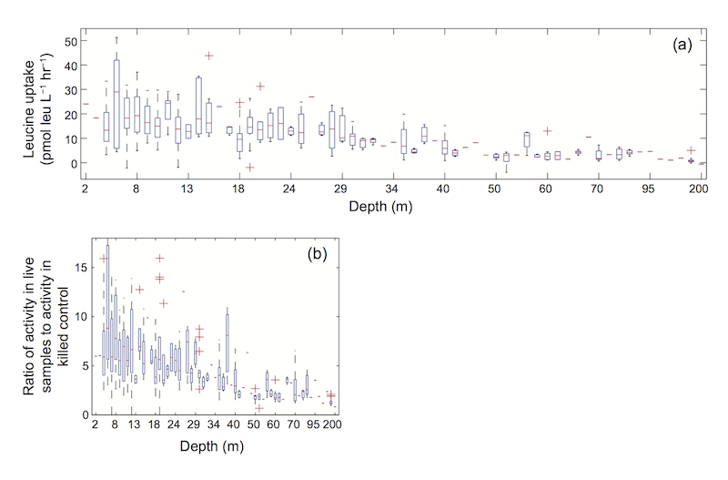
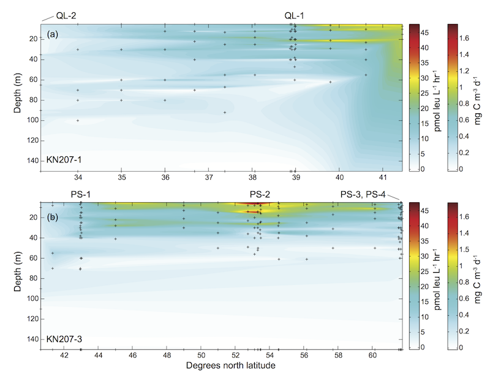

# 3H_Leu_BactProd
Suite of scripts for evaluating, calculating, and plotting rates of marine bacterial production using liquid scintillation counter data obtained from the 3H-leucine microcentrifuge method. These scripts and dependencies were used to process the BP data reported in:

Collins, J. R., B. R. Edwards, K. Thamatrakoln, J. E. Ossolinski, G. R. DiTullio, K. D. Bidle, S. C. Doney, and B. A. S. Van Mooy. 2015. [The multiple fates of sinking particles in the North Atlantic Ocean](http://dx.doi.org/10.1002/2014GB005037). Global Biogeochem. Cycles 29: 1471-1494, doi:10.1002/2014GB005037

Details of specific incubation methods are provided in the paper. The final, processed BP data generated using these scripts are archived to: http://www.bco-dmo.org/deployment/58787 (KN207-1 data) and http://www.bco-dmo.org/project/2136 (KN207-3 data)

3H_Leu_BactProd includes:

1. [plotQuenched.m](https://github.com/jamesrco/3H_Leu_BactProd/blob/master/plotQuenched.m): Run this script first. Obtains best-fit parameters for a cubic function [quenchcurve_cubicfitfunc.m](https://github.com/jamesrco/3H_Leu_BactProd/blob/master/quenchcurve_cubicfitfunc.m) for conversion of _H-number_ and _cpm_ to _dpm_, based on liquid scintillation counter efficiency. The function coefficients are written to an output file Quench_curve_fit_params.txt, which are then reimported by [riBPdata.m](https://github.com/jamesrco/3H_Leu_BactProd/blob/master/riBPdata.m) for use in rate calculations. plotQuenched.m allows the user to control the manner in which dpm values are calculated, rather than rely on the LSC's own internal calculation routine. With [plotQuenched.m](https://github.com/jamesrco/3H_Leu_BactProd/blob/master/plotQuenched.m):
   * [quenchcurve_cubicfitfunc.m](https://github.com/jamesrco/3H_Leu_BactProd/blob/master/quenchcurve_cubicfitfunc.m): A cubic function required by [plotQuenched.m](https://github.com/jamesrco/3H_Leu_BactProd/blob/master/plotQuenched.m).
   * [Quench_standards_20130924.xlsx](https://github.com/jamesrco/3H_Leu_BactProd/blob/master/dependencies/Quench_standards_20130924.xlsx): Example quench standard data from a liquid scintillation counter; you will want to run standards on your LSC and upload the data to a similar file.
   * [Quench_curve_fit_params.txt](https://github.com/jamesrco/3H_Leu_BactProd/blob/master/Quench_curve_fit_params.txt): An example output file from [plotQuenched.m](https://github.com/jamesrco/3H_Leu_BactProd/blob/master/plotQuenched.m), containing best-fit parameters. This file is parsed by [riBPdata.m](https://github.com/jamesrco/3H_Leu_BactProd/blob/master/riBPdata.m).

2. [riBPdata.m](https://github.com/jamesrco/3H_Leu_BactProd/blob/master/riBPdata.m): The main BP data processing script. Reads in and works up 3H-leucine bacterial production data from liquid scintillation counter. Parses metadata files for oceanographic cruises, then calculates 3H-leu uptake rates by CTD station and depth and/or experimental treatment and timepoint. Corrects for the "killed control" used in the microcentrifuge method after averaging of replicates. Can be used with the follow-on data visualization script [BactProd_plots.m](https://github.com/jamesrco/3H_Leu_BactProd/blob/master/BactProd_plots.m) (see below). Will work up all data given to it as long as it's in the right format, and then export results to a MATLAB .mat file and a series of .csv files. Required by [riBPdata.m](https://github.com/jamesrco/3H_Leu_BactProd/blob/master/riBPdata.m) are:
   * [Quench_curve_fit_params.txt](https://github.com/jamesrco/3H_Leu_BactProd/blob/master/dependencies/Quench_curve_fit_params.txt), the text file generated by [plotQuenched.m](https://github.com/jamesrco/3H_Leu_BactProd/blob/master/plotQuenched.m), above
   * LSC data in a spreadsheet, arranged as shown in the raw data file from Collins et al. 2015; this file is included in sample_data_metadata as [LSC_BP_data_KN207-1,KN207-3.xls](https://github.com/jamesrco/3H_Leu_BactProd/blob/master/sample_data_metadata/LSC_BP_data_KN207-1%2CKN207-3.xls). The "Sample ID" field in this file should contain sample numbers that correspond to the field of the same name in the [sample metadata file](https://github.com/jamesrco/3H_Leu_BactProd/blob/master/sample_data_metadata/BP_metadata_KN207-1%2CKN207-3.xlsx).
   * A [metadata log file](https://github.com/jamesrco/3H_Leu_BactProd/blob/master/sample_data_metadata/BP_metadata_KN207-1%2CKN207-3.xlsx) containing two kinds of sample metadata: (1) metadata for each sample, and (2) metadata for each set of incubations (and experimental treatments/timepoints, if appropriate) in which the samples were analyzed, including the incubation duration and temperature. Metadata that accompany the [Collins et al. 2015 LSC data](https://github.com/jamesrco/3H_Leu_BactProd/blob/master/sample_data_metadata/LSC_BP_data_KN207-1%2CKN207-3.xls) are provided in the file [BP_metadata_KN207-1,KN207-3.xlsx](https://github.com/jamesrco/3H_Leu_BactProd/blob/master/sample_data_metadata/BP_metadata_KN207-1%2CKN207-3.xlsx). The first tab of this Excel file ("Sample ID inventory") contains metadata of the first type, while the second tab ("Incu durations, temps, notes") contains metadata of the second type
   * For "full" processing of BP data from shipboard CTD casts, also required are files containing CTD cast metadata. The provided version of the script uses files from the two cruises aboard the _R/V Knorr_ that were the focus of Collins et al. 2015 ([Shipcast_metadata_KN207-1.xlsx](https://github.com/jamesrco/3H_Leu_BactProd/blob/master/sample_data_metadata/Shipcast_metadata_KN207-1.xlsx) and [Shipcast_metadata_KN207-3.xlsx](https://github.com/jamesrco/3H_Leu_BactProd/blob/master/sample_data_metadata/Shipcast_metadata_KN207-3.xlsx)) 

3. [BactProd_plots.m](https://github.com/jamesrco/3H_Leu_BactProd/blob/master/BactProd_plots.m): Generates summary statistics and depth vs. latitude plots from bacterial production data. Uses as input BP rates calculated using the script [riBPdata.m](https://github.com/jamesrco/3H_Leu_BactProd/blob/master/riBPdata.m). Provided version of script is configured for data from the BLATZ II and NA VICE cruises (KN207-1 and KN207-3). m. This script was used to generate the various BP plots presented in the [electronic supplement](http://api.onlinelibrary.wiley.com/asset/v1/doi/10.1002%2F2014GB005037/asset/supinfo%2Fgbc20317-sup-0001-auxiliarymaterial.pdf?l=SkaBT8QEx2o6i0QKtSKfbKSpRBoPPtyi%2BGmff2doSwOtO4rCR7fxjOWKudli%2BpahioOV3VEC0s7v%0AjCMR97HGThFVH2i92SpYjpt2rmOlpNg%3D) to [Collins et al. 2015](http://dx.doi.org/10.1002/2014GB005037). [BactProd_plots.m](https://github.com/jamesrco/3H_Leu_BactProd/blob/master/BactProd_plots.m) requires:
   * Two of the .csv files generated by [riBPdata.m](https://github.com/jamesrco/3H_Leu_BactProd/blob/master/riBPdata.m) (3H_Leu_BactProd_calcs_replicate_averaged_by_CTD.csv and 3H_Leu_BactProd_calcs_by_station_no.csv)
   * The three statistical summary plots require the function errorbar_tick (by Arnaud Laurent) for fine-tuning the widths of error bars. The function is contained in the m-file [errorbar_tick.m](https://github.com/jamesrco/3H_Leu_BactProd/blob/master/errorbar_tick.m), which I've re-posted under the BSD License. The original can be downloaded from the MATLAB file exchange at http://www.mathworks.com/matlabcentral/fileexchange/22826-adjust-error-bar-width/content/errorbar_tick.m

Examples of the plots generated with this script (from Collins et al. 2015):

Some statistics.

Depth versus latitude contour plots. Uses scatteredInterpolant(), meshgrid(), and contourf() as an easy alternative to Ocean Data View.

For details on the 3H-leucine microcentrifige method, see:

Kirchman, D., E. Knees, and R. Hodson. 1985. Leucine Incorporation and Its Potential as a Measure of Protein-Synthesis by Bacteria in Natural Aquatic Systems. Appl. Environ. Microbiol. 49: 599-607.

Kirchman, D. 2001. Measuring bacterial biomass production and growth rates from leucine incorporation in natural aquatic environments. In Methods in Microbiology. J. H. Paul, editor. Academic Press. 227-237.

